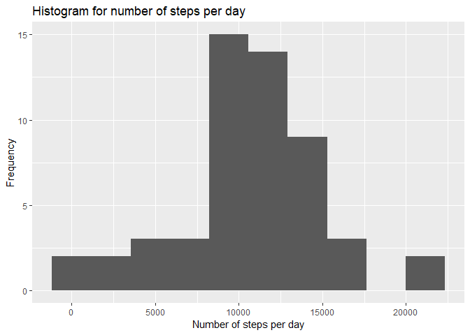
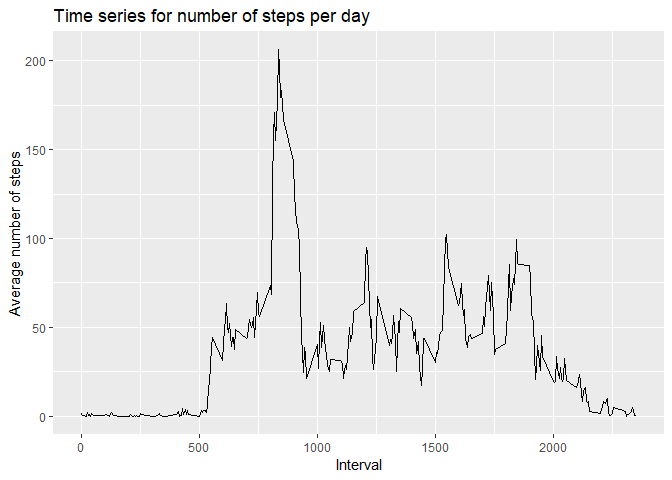
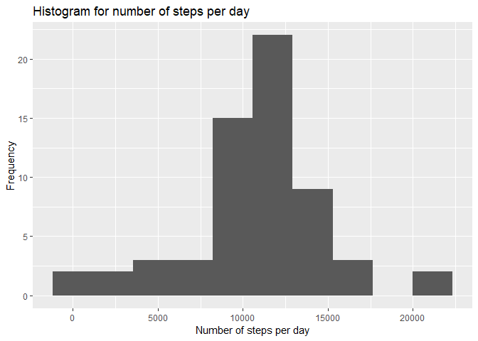
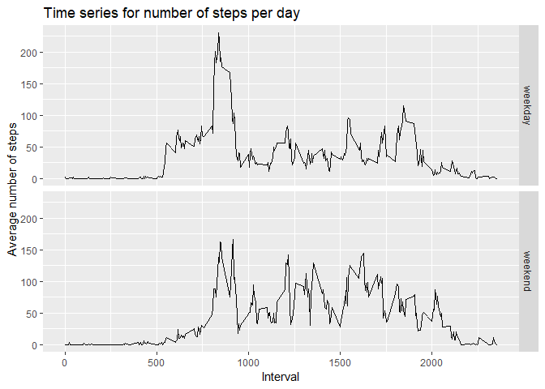

### Set the working directory

    setwd("C:\\Users\\ideapad 500\\Documents\\Ass2")

### Load the library

    library(dplyr)

    ## 
    ## Attaching package: 'dplyr'

    ## The following objects are masked from 'package:stats':
    ## 
    ##     filter, lag

    ## The following objects are masked from 'package:base':
    ## 
    ##     intersect, setdiff, setequal, union

    library(ggplot2)

### Loading and preprocessing the data

    activityfile <- "./activity.csv"
    df_activity <- read.csv(activityfile, header = TRUE)

 

### What is mean total number of steps taken per day?

 

##### a) Calculate the total number of steps taken per day by first filtering the na values and summing the number of steps, with grouping by the date. Store values in a dataframe.

    df_nsteps <- df_activity %>% filter(!is.na(steps)) %>% group_by(date) %>% summarise(total_steps=sum(steps))
    df_nsteps

    ## # A tibble: 53 x 2
    ##    date       total_steps
    ##    <fct>            <int>
    ##  1 2012-10-02         126
    ##  2 2012-10-03       11352
    ##  3 2012-10-04       12116
    ##  4 2012-10-05       13294
    ##  5 2012-10-06       15420
    ##  6 2012-10-07       11015
    ##  7 2012-10-09       12811
    ##  8 2012-10-10        9900
    ##  9 2012-10-11       10304
    ## 10 2012-10-12       17382
    ## # ... with 43 more rows

 

##### b) Histogram of the total number of steps taken each day

    #hist(df_nsteps$total_steps,xlab="Number of steps per day",main="Histrogram of number of steps per day")

    ggplot(data=df_nsteps, aes(total_steps)) + geom_histogram(bins=10) +  labs(title="Histogram for number of steps per day",x="Number of steps per day", y="Frequency") 

##### c) Mean and median number of steps taken each day

Calculate the mean and median number of steps and format each to 2
decimal places

    df_meanmed <- df_nsteps %>% summarise(mean_steps = mean(total_steps), median_steps=median(total_steps))

    mean_value <- df_meanmed %>% pull(mean_steps)
    mean_str <- sprintf(mean_value, fmt = '%#.2f')

    median_value <- df_meanmed %>% pull(median_steps)
    median_str <- sprintf(median_value, fmt = '%#.2f')

The **mean** of number of steps per day is **10766.19**

The **median** of number of steps per day is **10765.00**

 

### What is the average daily activity pattern?

 

##### a) Time series plot of the number of steps against interval

First calculate the average of number of steps against interval, store
in a dataframe and then plot

    df_avg <- df_activity %>% filter(!is.na(steps)) %>% group_by(interval) %>% summarise(avg_step=mean(steps)) 

    ggplot(data=df_avg, aes(x=interval, y=avg_step)) + geom_line() + labs(title="Time series for number of steps per day",x="Interval", y="Average number of steps") 

##### b) 5-minute interval, on average across all the days in the dataset that contains the maximum number of steps

First find the maximum number of average steps and find the interval
that contains this interval

    v_max <- df_avg %>% summarise(max_step = max(avg_step)) %>% pull(max_step)
    v_max_str <- sprintf(v_max, fmt = '%#.2f')

    v_interval<- df_avg %>% filter(avg_step==v_max) %>% pull(interval)

The interval that contains the maximum average number of steps
(**206.17**) is **835**

 

### Imputing missing values

 

##### a) Calculate and report the total number of missing values in the dataset (i.e. the total number of rows with NAs)

    v_nonas <- df_activity %>% filter(is.na(steps)) %>% summarise(number_nonas=n()) %>% pull(number_nonas) 

The number of missing values in the dataset is **2304**

 

##### b) Devise a strategy for filling in all of the missing values in the dataset

The mean of steps by the interval (ignoring the NAs) across all days
will be used to fill in the NAs.

We create a new column "steps\_new" to replace "steps". If the value of
"steps" is not NA, "steps" will be copied to "steps\_new". If the value
of "steps" is NA, the mean of steps by interval will be copied to
"steps\_new" instead.

    # if the value is not NA, copy the steps value to steps_new
    # if the valus is NA, copy the mean of the steps value by interval to steps_new
    df_new <- df_activity %>% group_by(interval) %>% 
      mutate( steps_new = ifelse(is.na(steps), mean(steps,na.rm=TRUE), steps)) %>% select(date,interval,steps_new)

Plot the histogram of the number of steps taken.

    # Recalculate the number of steps per day using the filled dataframe
    df_nsteps <- df_new %>% filter(!is.na(steps_new)) %>% group_by(date) %>% summarise(total_steps=sum(steps_new))

    ggplot(data=df_nsteps, aes(total_steps)) + geom_histogram(bins=10) +  labs(title="Histogram for number of steps per day",x="Number of steps per day", y="Frequency") 

There is **no discernable difference** in shape of the histrogram except
that the frequency has increased.

Recalculate the mean and median of the number of steps per day

    df_meanmed <- df_nsteps %>% summarise(mean_steps = mean(total_steps), median_steps=median(total_steps))

    mean_value <- df_meanmed %>% pull(mean_steps)
    mean_str <- sprintf(mean_value, fmt = '%#.2f')

    median_value <- df_meanmed %>% pull(median_steps)
    median_str <- sprintf(median_value, fmt = '%#.2f')

The **new mean** of number of steps per day is **10766.19**

The **new median** of number of steps per day is **10766.19**

There appears to be little difference between the mean and median of the
filled dataframe.

 

### Are there differences in activity patterns between weekdays and weekends?

 

##### a) Create a new factor variable in the dataset with two levels - "weekday" and "weekend" indicating whether a given date is a weekday or weekend day.

 

    # Create a new column indicating whether it is weekday or weekend
    # based on the day of the week using the weekdays() function
    df_new_wkdy <- df_new  %>% 
      mutate(wkdend = case_when(
        weekdays(as.Date(date))=='Monday' ~ 'weekday',
        weekdays(as.Date(date))=='Tuesday' ~ 'weekday',
        weekdays(as.Date(date))=='Wednesday' ~ 'weekday',
        weekdays(as.Date(date))=='Thursday' ~ 'weekday',
        weekdays(as.Date(date))=='Friday' ~ 'weekday',
        weekdays(as.Date(date))=='Saturday' ~ 'weekend',
        weekdays(as.Date(date))=='Sunday' ~ 'weekend'
      )
    )

    # Convert the column to a factor
    df_new_wkdy$wkdend <- as.factor(df_new_wkdy$wkdend)

 

##### b) Make a panel plot containing a time series plot of the 5-minute interval (x-axis) and the average number of steps taken, averaged across all weekday days or weekend days (y-axis)

 

    # Recalculate the average number of steps by interval
    df_avg <- df_new_wkdy %>% group_by(interval,wkdend) %>% summarise(avg_step=mean(steps_new)) 

    # Plot the graph by weekday and weekend
    ggplot(data=df_avg, aes(x=interval, y=avg_step)) + geom_line() + labs(title="Time series for number of steps per day",x="Interval", y="Average number of steps") + facet_grid(wkdend ~ .)

